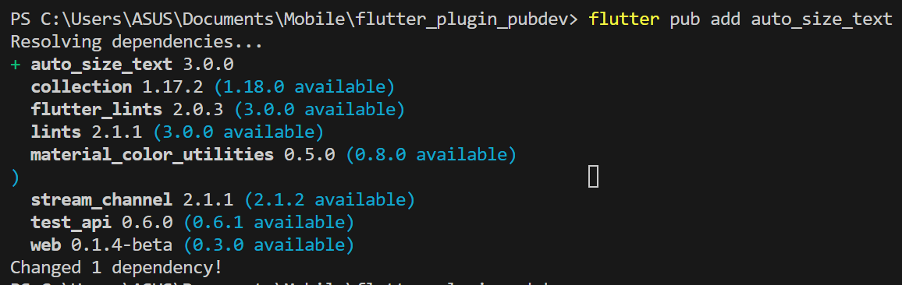
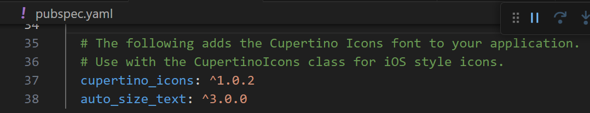
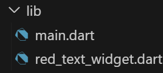
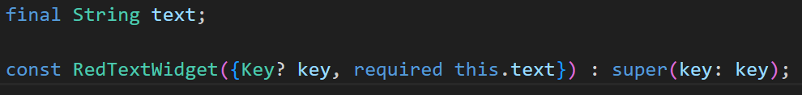
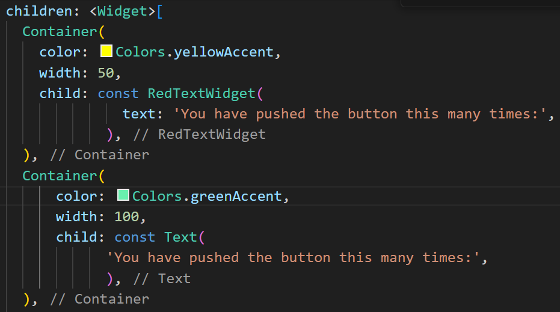
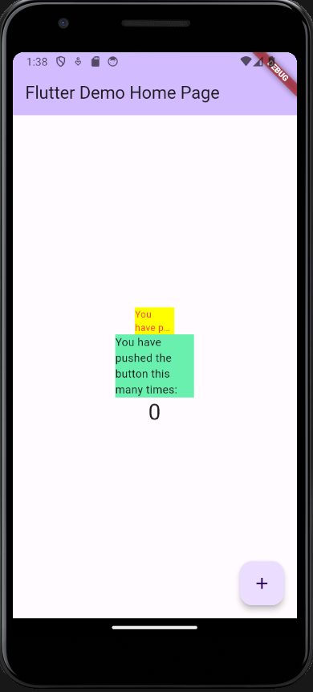

# Laporan Praktikum Manajemen Plugin

> Nama    : Syahla' Syafiqah Fayra
>
> NIM     : 2141720015
>
> Kelas   : TI - 3G

## 7. Praktikum Menerapkan Plugin di Project Flutter

### Langkah 1: Buat Project Baru
Buatlah sebuah project flutter baru dengan nama flutter_plugin_pubdev. Lalu jadikan repository di GitHub Anda dengan nama flutter_plugin_pubdev.

### Langkah 2: Menambahkan Plugin
Tambahkan plugin auto_size_text menggunakan perintah berikut di terminal

Jika berhasil, maka akan tampil nama plugin beserta versinya di file pubspec.yaml pada bagian dependencies.

### Langkah 3: Buat file red_text_widget.dart
Buat file baru bernama red_text_widget.dart di dalam folder lib lalu isi kode seperti berikut.

### Langkah 4: Tambah Widget AutoSizeText
Masih di file red_text_widget.dart, untuk menggunakan plugin auto_size_text, ubahlah kode return Container() menjadi seperti berikut.

Setelah Anda menambahkan kode di atas, Anda akan mendapatkan info error. Mengapa demikian? Jelaskan dalam laporan praktikum Anda!
        
    Terjadi error karena belum didefinisikan variabel 'text'. 

### Langkah 5: Buat Variabel text dan parameter di constructor
Tambahkan variabel text dan parameter di constructor seperti berikut.

### Langkah 6: Tambahkan widget di main.dart
Buka file main.dart lalu tambahkan di dalam children: pada class _MyHomePageState

### Hasil Run
Run aplikasi tersebut dengan tekan F5, maka hasilnya akan seperti berikut.

---
## Tugas Praktikum
1. Selesaikan Praktikum Menerapkan Plugin di Project Flutter diatas, lalu dokumentasikan dan push ke repository Anda berupa screenshot hasil pekerjaan beserta penjelasannya di file README.md!
2. Jelaskan maksud dari langkah 2 pada praktikum tersebut!

    > Maksud dari langkah 2 yaitu untuk menambahkan plugin auto_size_text kedalam proyek flutter. Plugin ini menyediakan widget  'AutoSizeText' yang berfungsi untuk memungkinkan teks secara otomatis menyesuaikan ukuran teksnya sesuai dengan lebar yang ttersedia dalam widgetnya.

3. Jelaskan maksud dari langkah 5 pada praktikum tersebut!

    > Pada baris pertama merupakan deklarasi variabel 'text' dengan tipe data string yang diberi modifier final. 
    > Pada baris kedua merupakan konstruktor untuk widget 'RedTextWidget'. ini adalah bagian dari widget yang digunakan untuk menginisialisasi widget dan menerima parameter yang dibutuhkan, 

4. Pada langkah 6 terdapat dua widget yang ditambahkan, jelaskan fungsi dan perbedaannya!

    > Menggunakan container dengan 'RedTextWidget' memiliki fungsi yaitu untuk mengatur tampilan 'RedTextWidget' yang telah dibuat sebelumnya yang menampilkan teks berwarna merah 
    > Menggunakan container dengan 'Text' memiliki fungsi yaitu mengatur tampilan dan dekorasi text yang digunakan untuk menampilkan teks.
    > Perbedaan yaitu terletak pada dekorasi, warna latar belakang, dan lebar dari masing - masing container serta konten yang ditampilkan dalamnya. 

5. Jelaskan maksud dari tiap parameter yang ada di dalam plugin auto_size_text berdasarkan tautan pada dokumentasi ini !

    > 1. key * -> Salah satu parameter konstruktor yang digunakan untuk memberikan kunci.(identifier) unik kepada widget 'AutoSizeText'.
    > 2. TextKey -> Salah satu parameter yang digunakan untuk mengatur kunci widget text yang dihasilkan.
    > 3. Style * -> Parameter yang digunakan untuk menentukan gaya atau tampilan teks yang ditampilkan oleh widget 'AutoSizeText'.
    > 4. minFontSize -> Parameter yang digunakan untuk ukuran minimum teks yang ditampilkan oleh widget 'AutoSizeText'. 
    > 5. maxFontSize -> Parameter yang digunakan untuk ukuran maximum teks yang ditampilkan oleh widget 'AutoSizeText'. 
    > 6. stepGranularity -> Parameter yang digunakan untuk mengatur sejauh mana ukuran teks dapat disesuaikan saat widget AutoSizeText mencoba menyesuaikan ukuran teks secara otomatis untuk memuat teks dalam batasan yang telah ditentukan.
    > 7. presetFontSizes -> Parameter yang digunakan untuk mengatur kumpulan ukuran font yang sudah ditentukan yang akan digunakan oleh widget 'AutoSizeText'.
    > 8. group -> Parameter yang digunakan untuk mengelompokkan beberapan instance 'AutoSizeText' bersama-sama sehingga mereka dapat memiliki ukuran font yang sama.
    > 9. textAlign* -> Parameter yang digunakan untuk mengatur penyebaran (alignment) teks dalam widget 'AutoSizeText;.
    > 10. textDirection* -> Parameter yang digunakan untuk mengatur arah teks dalam widget 'AutoSizeText'.
    > 11. locale* -> Parameter yang digunakan untuk memilih font ketika karakter unicode yang sama dirender secara berbeda, tergantung pada lokasi.
    > 12. softWrap* -> Parameter yang digunakan untuk mengontrol apakah teks dalam widget 'AutoSizeText' boleh mematahkan baris atau tidak ketika teks melebihi lebar yang tersedia di dalam widget.
    > 13. wrapWords -> Parameter yang digunakan untuk memastikan apakah kata kata yang tidak dimuat dalam satu baris harus dibungkus, defaultnya adalah true untuk berperilaku seperti teks.
    > 14. overflow* -> Parameter yang digunakan untuk mengatur cara teks ditangani jika melebihi batasan ruang yang tersedia.\
    > 15. overflowReplacement -> Parameter yang digunakan untuk menentukan widget yang akan digunakan sebagai pengganti saat teks melebihi lebar yang tersedia. 
    > 16. textScaleFactor* -> Parameter yang digunakan untuk mengontrol faktor skala teks yang akan diterapkan pada teks yang ditampilkan dalam widget.
    > 17. maxLines -> Parameter yang digunakan untuk menentukan jumlah maksimal baris yang akan ditampilkan dalam widget.
    > 18. semanticsLabel* -> Parameter yang digunakan untuk label semantik alternatif.
